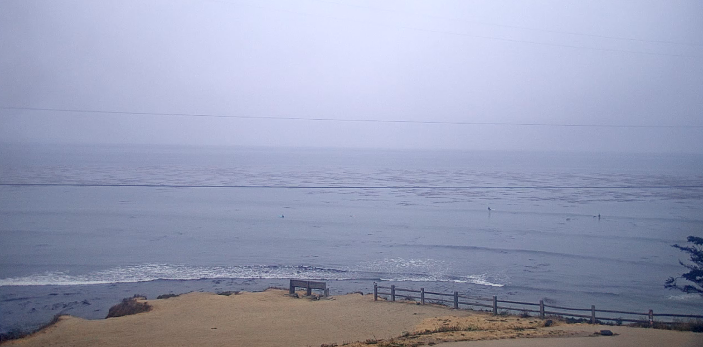
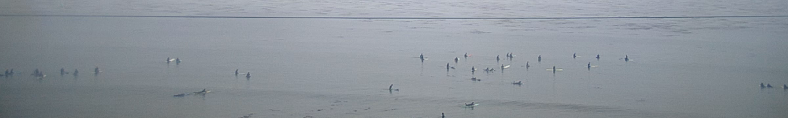
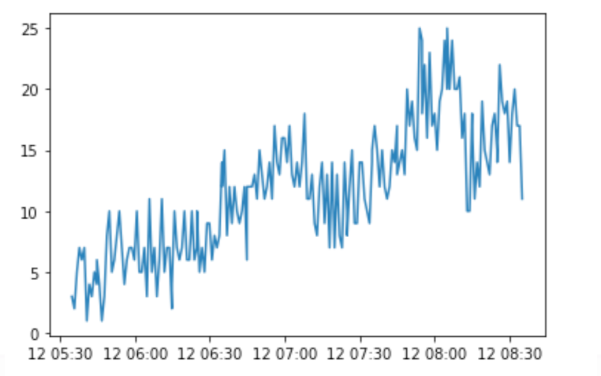
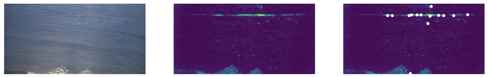

# Tracking the Surfer Population through Webcams

The aim of this project is to count the number of surfers in an image, so the population of surfer throughout the day and seasons can be automatically captured for further analysis.

This is a Final Project in the Deep Learning Class at the University of San Fransicso.

# Inspiration

We drew inspiration from the [Dino Repository](https://github.com/facebookresearch/dino) which presents a paper on [Self-Supervised Learning with Vision Transformers](https://arxiv.org/abs/2104.14294).

The repo includes impressive visualizations of the Vision Transformer (ViT) attention weights and how they are quite good at attending to objects in a scene.  

# Our Work

Our work primarily focuses on applying pretrained Vision Transfomers to Surfline Webcams. The primary goal of our project was to be able to count the number of surfers present in the webcams' frame without labels. To achieve this we passed frames of the videos through the ViT and created a heatmap image from the attention mask output. This heatmap image was then passed through a blob detector to predict the number of surfers. Below is an example heatmap output from a preliminary test with a short cropped video.

# Data

For this task we needed to gather and create our own novel dataset. We built a script to automatically pull rewind data from the webcams at Surfline.  That code is [here](https://gist.github.com/tukavic/da2238ed28eeb00b97d9acecf29c2076). Premium membership is required for access. In order to reduce the amount and size of data we decided to keep very few frames from each video. Additionally, since the webcam we accessed was not zoomed in, we need to cut out the possible distractions such as land and fences.

### Preprocessing Pipeline:

1. Download a day’s worth of videos (5:30am - 8:30pm) in 10 minute increments
2. Take 1 frame per minute of video and save timestamp
3. Crop each frame to only focus on surfing area

Here is an example of what an uncropped image looked like:

And here is an example frame from after preprocessing:

# Pipeline

Our pipeline from Raw mp4 video to image counts is as follows:

## 1. Extract
Extract frame images in 1 minute increments and crop to simplify
## 2. Attend
Create heatmap image from output attention map of ViT
## 3. Blob
Pass masked image through Skimage blob detection

# Results

We show a short clip of analysis from dawn for a few hours.  This clip shows the original image that was analyzed with the attention heatmap extracted from the ViT `CLS` token across all heads, and the resulting blob detections.  There are a few problems with the model when there is no object, because the attention is doing its best to find an object, so some blobs will be randomly detected if there are not objects in the scene.

We also predict the minute by minute count of surfers.

## Trouble Points

* Finding which attention head to use.
* Which blob detection method to use (3 available through skimage).
    * Tweaking of hyperparameters to focus on surfers.
* For eval, difficult to manually annotate a set for comparison.
* When no surfers present, attention is focused on other objects such as a powerline in front of the webcam.

## Further Work

* Finetune DINO ViT on our data
* Manually label a training set of videos with number of surfers
* Train a separate model for predicting the number of surfers taking attention mask as input

